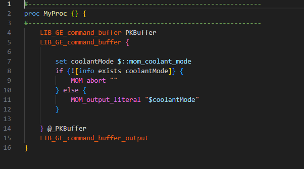
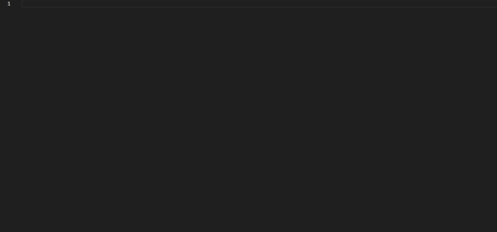

# TCL and Siemens NX Language Support for Visual Studio Code

This extension provides enhanced language support for the TCL language and some Siemens NX commands, primarily used for the Siemens NX Post Configurator.

## Features

- **Syntax Highlighting**: Enjoy syntax highlighting for TCL and Siemens NX commands to improve code readability.
- **Autocompletion**: Benefit from autocomplete suggestions for TCL snippets, NX MOM variables, events, buffer commands, and more.
- **Snippets**: Quickly insert commonly used code snippets for TCL and Siemens NX development.
- **Variable Recognition**: Efficiently navigate your code with automatic recognition and autocomplete for procedures, global variables, buffers, and more.
- **Visual Enhancements**: Enhance your coding experience with visual aids such as syntax images and example GIFs.

## Screenshots

### Syntax highlighting

### Autocomplete, snippets

## Usage

To install this extension, search for "TCL and Siemens NX Language Support" in the Visual Studio Code Extensions Marketplace and click "Install".

## Author

Niklas Beitler

## License

This project is licensed under the MIT License - see the [LICENSE](LICENSE) file for details.

